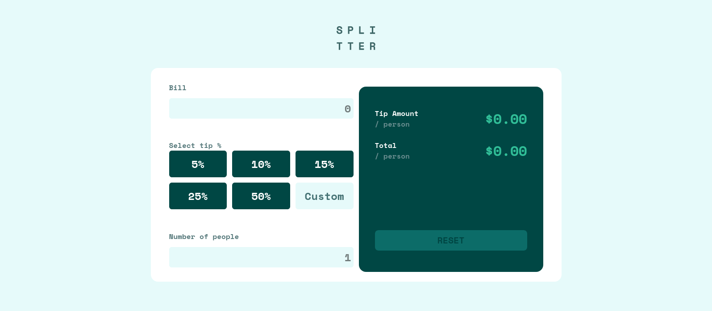

# Frontend Mentor - Tip calculator app solution

**For training use only. Do not use in production. No warranty.**

This is a solution to the [Tip calculator app challenge on Frontend Mentor](https://www.frontendmentor.io/challenges/tip-calculator-app-ugJNGbJUX). Frontend Mentor challenges help you improve your coding skills by building realistic projects.

## Table of contents

- [Overview](#overview)
  - [The challenge](#the-challenge)
  - [Screenshot](#screenshot)
  - [Links](#links)
- [My process](#my-process)
  - [Built with](#built-with)
  - [What I learned](#what-i-learned)
  - [AI Collaboration](#ai-collaboration)
- [Author](#author)
- [Acknowledgments](#acknowledgments)

## Overview

### The challenge

Users should be able to:

- View the optimal layout for the app depending on their device's screen size
- See hover states for all interactive elements on the page
- Calculate the correct tip and total cost of the bill per person

### Screenshot




### Links

- Solution URL: [https://github.com/vanhog/tip-calculator-frontendmentor](https://github.com/vanhog/tip-calculator-frontendmentor)
- Live Site URL: [https://app.netlify.com/projects/vanhogs-fm-tipcalculator/overview](https://app.netlify.com/projects/vanhogs-fm-tipcalculator/overview)

## My process

### Built with

- Semantic HTML5 markup
- CSS custom properties
- Flexbox
- CSS Grid
- Mobile-first workflow
- Tailwindcss
- AI free

### What I learned

- How to refactor code. I've coded another and smaller tip calculator before and was able to reuse and adapt the code for this challenge. 

- How to use a background image to annotate an inputfield

```css
style="
	background-image: url('./images/icon-person.svg');
	background-repeat: no-repeat;
	background-position-y: center;
	background-size: 5% 60%;
"
```
- How to effectively work with HTML elements using forEach
```js
qualityButtons.forEach(({ button, value }) => {
  button?.addEventListener('click', () => {
    serviceQuality = value;

    qualityButtons.forEach(({ button: btn }) => {
      btn?.classList.remove(...activeClasses);
    });

    button.classList.add(...activeClasses);

    setTip();
  });
});
```


### Useful resources

- [Stack Overflow 2913236](https://stackoverflow.com/questions/2913236/html-text-input-field-with-currency-symbol) - This helped me to figure out how to add a currency symbol to an input field.


### AI Collaboration

For this challenge - as for all my challenges here until now - I uses AI as a search engine. 

## Author

- Website - [Dieter H. Hoogestraat (Dee)](https://www.hoogestraat.com)
- Frontend Mentor - [@vanhog](https://www.frontendmentor.io/profile/vanhog)